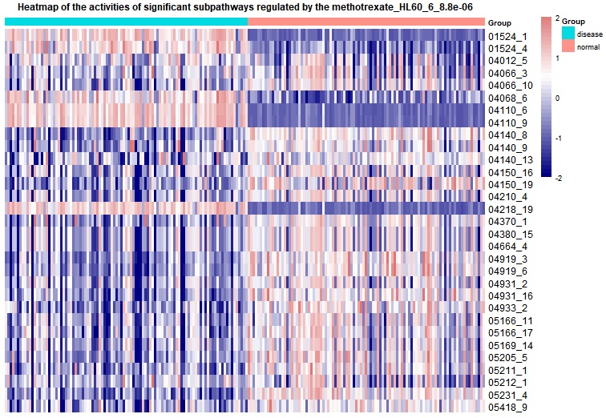

```{r , include = FALSE}
library(DRviaSPCN)
```

### <font face="微软雅黑"> Introduce </font>
<font face="微软雅黑"> We developed a novel software package (DRviaSPCN) that enables repurposing drugs via a subpathway crosstalk network. The main process includes evaluating the eigenvector centrality of subpathways and identifying dysregulated subpathways in the subpathway-subpathway network through random walk algorithm, calculating the enrichmentscore of subpathways and weighting them with corresponding centrality score to get weighted enrichmentscore(weighted-ES), calculating the Disease-Drug reverse association score (RS) and final score KS through constructing the reverse relationship with weighted-ES of subpathways between disease and drugs. Based on the KS and the corresponding statistical significance, we can determine the optimal drugs. There are also several functions used to visualize the results such as visualization of the subpathway network structure of interest, chemical molecular formula of the drug or compound, and heatmap of the expression of subpathways in different sample types that are regulated by disease.

This vignette illustrates how to easily use the **DRviaSPCN package**. Here, with the use of functions in this package, users could identify potential therapeutic drugs for disease through calculating Disease-Drug reverse association score.

**The method consists of three parts:**

**1.**Constructing network and applying the random walk. We downloaded all pathways from the KEGG database. Then we use **SubpathwayMiner package** to extract subpathways from pathways. Next, in our method, we first constructed a Subpathway(SP)-GO bipartite network. We defined an edge between a subpathway and a Go term if they have a common gene. We used the difference level of the shared gene between two types of samples and the Jaccard index between a pair of subpathways and go term to define the weight of the edge. Next, we made the SP-GO network convert to SP-SP network, similarly, we defined an edge between two subpathways if they have a common biology function, and the edge weights will be larger for pairs of subpathways that relate more to GO function. Then, we used the random walk algorithm to calculate eigenvector centrality which can reflect how central each subpathway is in this network. Finally, the statistical significance (pvalue) of these centrality scores was assessed using a bootstrap-based randomization method. We could screen the dysregulated subpathways through adjusted pvalue.

**2.**In this part, CMap build 02 raw data was downloaded from the CMap website (Lamb et al. 2006). After constructing gene expression profiles, the log2 fold-change (FC) was used to represent differentially expressed levels of genes between the drug treatment (distinguish different concentrations, duration and cell lines of the same drug) and the control groups. We calculated the enrichment score of the subpathways with the log2FC of disease genes and drug genes by GSEA. After calculating the enrichmentscore (*ES*) of subpathways, we weighted them with corresponding centrality scores to get weighted enrichmentscore (weighted-ES). 

**3.**In this part, to test if a drug could treat a specific disease, we defined a Disease-Drug reverse association score (*RS*) to reflect the treatment extent of a drug at the subpathway level. For every drug and a specific disease, the subpathways were ranked in descending order based on the corresponding weighed-ES. We mapped the up-and down-regulated
subpathways by disease to the ranked list of every drug to calculate the *ks.up* and *ks.down*. And the *RS* is equal to *ks.up - ks.down*. Then, the *RS* of drugs were ranked in descending order. Drugs acting on different cell lines, duration and concentrations are extracted as a set. We mapped the drug sets to the ranked list of *RS* to calculate the final association score *KS*. A drug with a greater negative or positive *KS* indicates that the drug may have a positive or negative effect on the disease. Then, we calculated the statistical significance (pvalue) through random permutations. Users could screen out optimal therapeutic drugs according to a specific threshold. 

  
+  This package provides the `DE2SubPath` function to calculate the centrality score of subpathways and corresponding pvalue.  

+  This package provides the `getSubpathscore` function to calculate the weighted-ES of subpathways.

+  This package provides the `optimaldrugs` function to calculate the RS of drugs and corresponding pvalue.
  
+  This package provides the `plotSPW` function to plot subpathway network structure.

+  This package provides the `getMolecularFM` function to plot chemical molecular formula of the drug or compound.

+  This package provides the `Disease2SPWheatmap` function to plot heatmap of the activities of subpathways in different sample type that are regulated by disease.

+  This package provides the `Drug2SPWheatmap` function to plot heatmap of the activities of subpathways in different sample type that are regulated by drugs.
  
+  This package provides the `GetExample` function to return example data and environment variables, such as GEP, label and so on.</font>

In addition, the essential data `DrugPscoreMatrix` and `DrugPvalueMatrix` which are subpathways activity (weighted-ES) and statistic significance (pvalue) of subpathways centrality score regulated by all drugs were stored in our DRviaSPCNData package. Users could download and use this package by the following code:

```{r eval=FALSE}
### Download DRviaSPCNData package from GitHub.
library(devtools)
install_github("hanjunwei-lab/DRviaSPCNData",force = TRUE)
library(DRviaSPCNData)
### Get weighted-ES of subpathways.
DrugPscoreMatrix<-Getlist("DrugPscoreMatrix")
## Get pvalue of subpathways centrality score.
DrugPvalueMatrix<-Getlist("DrugPvalueMatrix")
```


*****
### <font face="微软雅黑">Example 1 : Calculating the centrality scores of subpathways. </font>

<font face="微软雅黑">  The function `DE2SubPath` is used to calculate the centrality scores of subpathways and filter out subpathways that are significantly regulated by disease or drugs according to the pvalue in the result of this function. According to our method, in this function, the user needs to input 6 variables. All six variables can obtain from the package environment variables, those data from KEGG and GO, and the user can also change at will. Notely, the input gene expression profile we provide is just a part of the Breast Cancer gene expression profile from the TCGA database.

The commands are as follows: </font>

```{r,message=FALSE}
###Load depend package
library(igraph)
###Obtain input data
GEP<-GetExample('GEP')# Get the gene expression profile.
label<-GetExample('label')# Get the sample class label.
SubPathwayInfo<-GetExample('SubPathwayInfo')# Get the subpathway data
GoInfo<-GetExample('GoInfo')# Get the biology process data
Jaccardscore<-GetExample('Jaccardscore')# Get the jaccardscore matrix
GoSubPconGene<-GetExample('GoSubPconGene')# Get shared genes matrix
```
```{r eval=FALSE}
###Run the function
DE2SubPathresult<-DE2SubPath(inexpData=GEP,Label=label,
             Subpathway=SubPathwayInfo,Go=GoInfo,Jaccard=Jaccardscore,
             Go_SubPath_gene=GoSubPconGene,perm=FALSE)

DE2SubPathresult_P<-DE2SubPath(inexpData=GEP,Label=label,
             Subpathway=SubPathwayInfo,Go=GoInfo,Jaccard=Jaccardscore,
             Go_SubPath_gene=GoSubPconGene,perm=TRUE)

```
```{r echo=FALSE}
###Get the result of this function
DE2SubPathresult<-GetExample('DE2SubPathresult')
DE2SubPathresult_P<-GetExample('DE2SubPathresult_P')
```
```{r}
###view first ten subpathways result without random permutations
DE2SubPathresult[1:10,c(1,3,5,6,7)]
###view first ten subpathways result with random permutations
DE2SubPathresult_P[1:10,c(1,3,5,6,7)]

```

*****

### <font face="微软雅黑"> Example 2 : Calculating the weighted-ES of subpathways. </font>

<font face="微软雅黑"> The function `getSubpathscore` is used to calculate weighted-ES of subpathways. We calculate the enrichment score of the subpathways with log2FC of disease genes and drug genes by GSEA and weighted them with centrality scores respectively. Notely, users could obtain weighted-ES of subpathways of all drugs from the DRviaSPCNData package through function "Getlist('DrugPscoreMatrix')".

The commands are as follows: </font>

```{r,message=FALSE}

###Load depend package
library(clusterProfiler)

###Run the function
SubPathscore<-getSubpathscore(DE2SubPathresult=DE2SubPathresult,
                              inexpData=GEP,Label=label)

###view first ten subpathways result
head(SubPathscore,10)
```

*****

### <font face="微软雅黑"> Example 3 : Calculating the Disease-Drug reverse association score and corresponding pvalue of drugs. </font>

<font face="微软雅黑"> The function `optimaldrugs` is used to calculate the *KS* and statistic significance of drugs. The detailed algorithm can be seen in the introduction part. Users could screen out the optimal therapeutic drugs according to a specific threshold. Here we provide weighted and unweighted two methods to calculate the score, which can be selected by parameters *weight = ''* . The screening method of the up and down subpathways can be adjusted according to the parameters *pcut = ''* and *topcut = ''*.
The commands are as follows: </font>

```{r,eval=FALSE}

###Run the function
Opdrugresult<-optimaldrugs(SubPathscore=SubPathscore,
               Drug_Pscore_matrix=DrugPscoreMatrix,nperm=1000,cut='p',
               topcut=20,pcut=0.01,weight=FALSE)

```
```{r echo=FALSE}
###Get the result of this function
Opdrugresult<-GetExample('Opdrugresult')
```
```{r}
###view first ten drugs result
head(Opdrugresult,10)
```

*****

### <font face="微软雅黑"> Visualize 1: Plot a subpathway network structure graph. </font>

<font face="微软雅黑">  The function `plotSPW` used to plot a subpathway network structure graph. The user just needs to input an interset subpathway id such as "00020_4".

The commands are as follows: </font>

```{r,message=FALSE,fig.width=7,fig.height=5}
###load depend package
library(igraph)
###plot network graph of the subpathway "00020_4"
plotSPW("00020_4")

```

*****

## <font face="微软雅黑"> Visualize 2: Plot a chemical molecular formula of the drug or compound .</font>

#####
<font face="微软雅黑">  The function `getMolecularFm` can obtain a chemical molecular formula of the drug or compound. Then users could visualize the molecular formula through function "plot".
  
The commands are as follows:  </font>

```{r,results='hide',message=FALSE,fig.width=7,fig.height=5}
###Load depend package
library(ChemmineR)
library(rvest)
###Obtain molecular formula and visualize it.
Mole_formula<-getMolecularFm(drugname ="methotrexate")
plot(Mole_formula)

```

*****

## <font face="微软雅黑"> Visualize 3: Plot a heatmap of the subpathways that are regulated by disease.</font>

#####
<font face="微软雅黑">  The function `Disease2SPWheatmap` plots a heat map of the subpathways that are regulated by disease. The input is the result of function `DE2SubPath`, disease gene expression profile and sample class in the expression profile. Users could change the threshold
that is used to screen significant subpathways through the param *pcut* .
  
The commands are as follows:  </font>

```{r,message=FALSE,results='hide',fig.width=7,fig.height=5}

###Load depend package
library(GSVA)
library(pheatmap)

###Run the function
Disease2SPWheatmap(DE2SubPathresult_P,exp=GEP,Label=label,pcut=0.05
                   ,bk=c(-2,2),cluster.rows=FALSE,cluster.cols=FALSE,
                   show.rownames=TRUE,show.colnames=FALSE,
                   col=c("navy","firebrick3"),cell.width=NA,
                   cell.height=NA,scale="row",fontsize=7,
                   fontsize.row=9,fontsize.col=10)
```

*****

## <font face="微软雅黑"> Visualize 4: Plot heatmaps of the subpathways that are regulated by drugs.</font>

#####
<font face="微软雅黑">  The function `Drug2SPWheatmap` plots heatmaps of the subpathways that are regulated by drugs. The input is a character which is drug name, disease gene expression profile and sample class in the expression profile. Users could change the threshold that is used to screen significant subpathways through the param *pcut*. The result of this function is a list including all heatmap results of the same drug which are used in different cell lines and concentrations.
  
The commands are as follows:  </font>

```{r,eval=FALSE}
###Load depend package
library(GSVA)
library(pheatmap)
###Run the function
heatmap.list<-Drug2SPWheatmap(drugname="methotrexate",
              Drug_Pvalue_matrix=DrugPvalueMatrix,exp=GEP,
              Label=label,pcut=0.05,bk=c(-2,2),cluster.rows=FALSE,
              cluster.cols=FALSE,show.rownames=TRUE,
              show.colnames=FALSE,col=c("navy","firebrick3"),
              cell.width=NA,cell.height=NA,scale="row",
              fontsize=6,fontsize.row=9,fontsize.col=10)

###view the result
heatmap.list[[1]]
dev.off()
```

```{R,echo=FALSE}

```
